# 🏡 EliteHomes — Real Estate Landing Page

A high-precision, responsive, and visually stunning real estate landing page built with **HTML5**, **CSS3**, **Bootstrap 5**, and **Font Awesome**. This application features an exact pixel-perfect design replica based on modern real estate UI standards.

---

## 📸 Visual Previews & Screenshots

### 1. 🏰 Hero Section & Navigation
#### Hero Section & Search Console
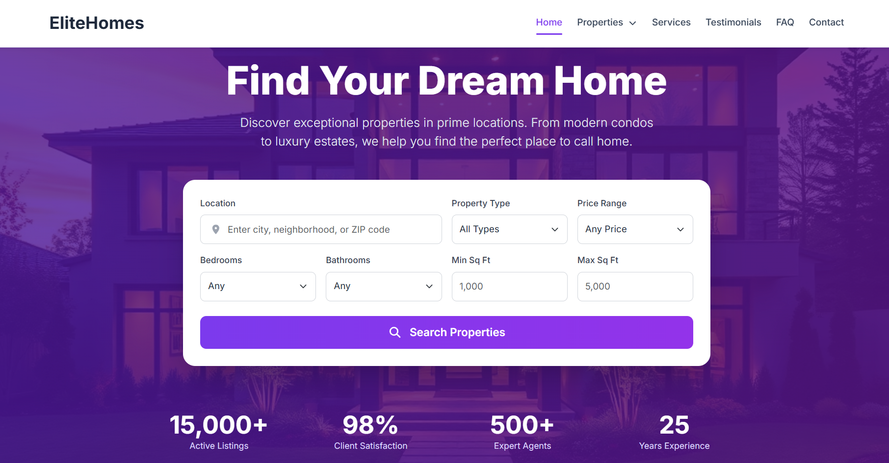

#### Properties Mega Menu Dropdown
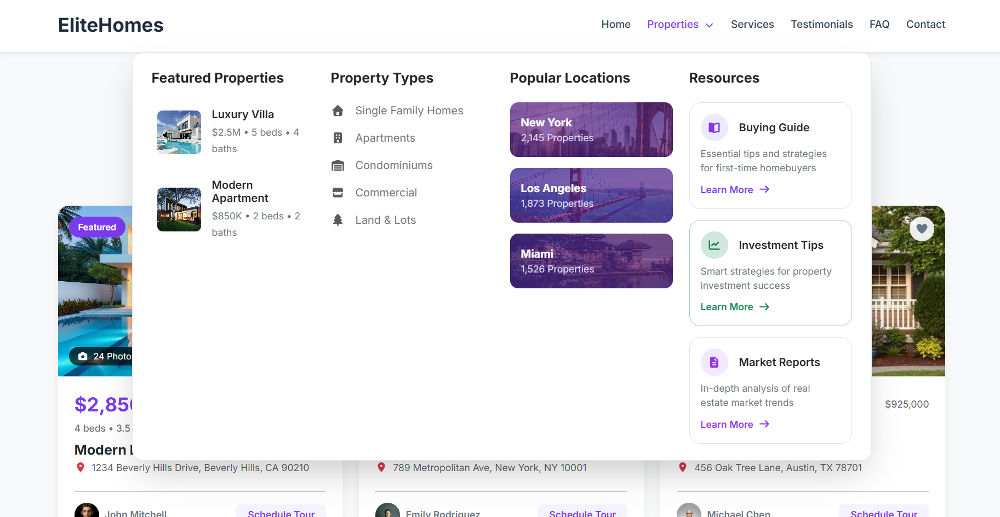

---

### 2. 🏡 Featured Properties Section
#### Featured Properties Collection
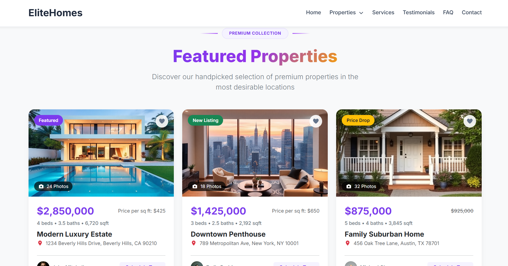

---

### 3. 🛠️ Our Services Section (Interactive Tabs)
#### Buying Tab
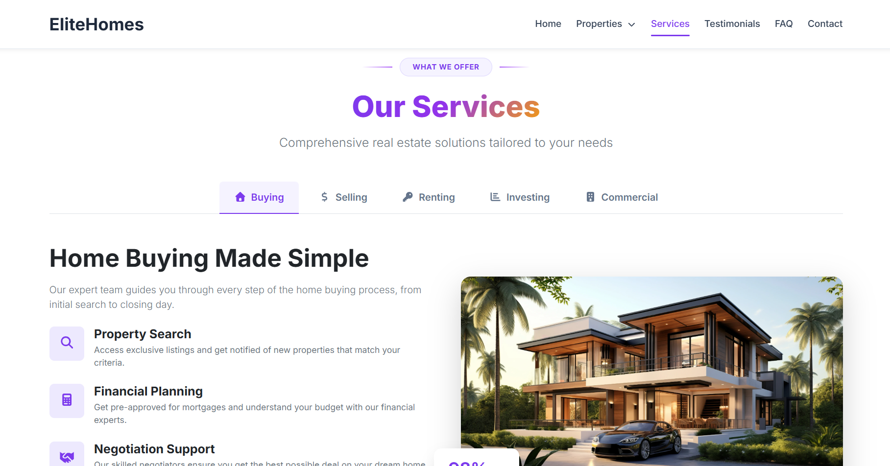

#### Selling Tab
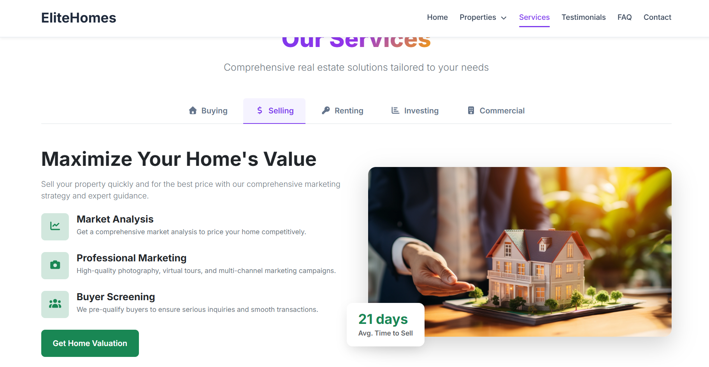

#### Renting Tab
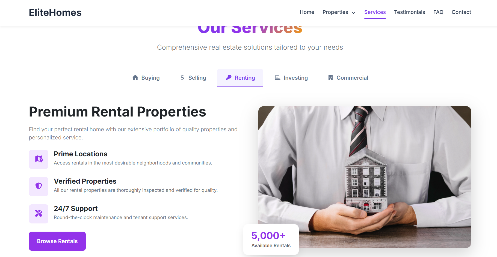

#### Investing Tab
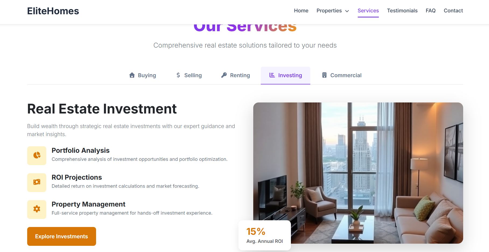

#### Commercial Tab
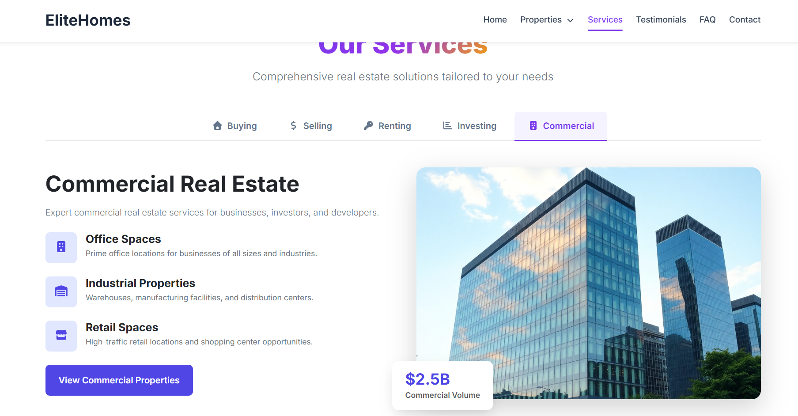

---

### 4. 💬 Testimonials & ❓ FAQ Sections
#### Testimonials Carousel ("What Our Clients Say")
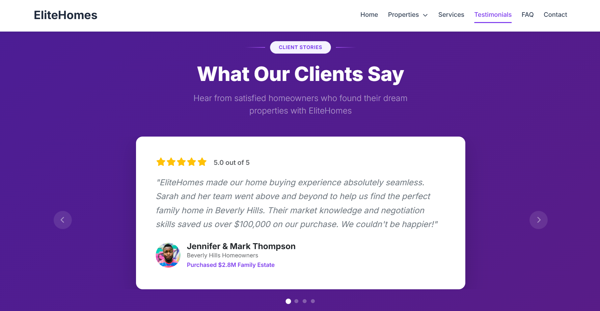

#### Frequently Asked Questions (FAQ Accordion)
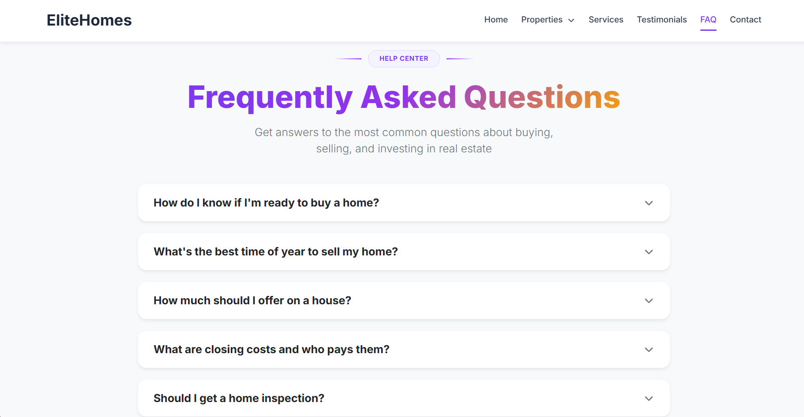

---

### 5. 📬 Contact Us & Footer
#### Contact Us & Connect Section
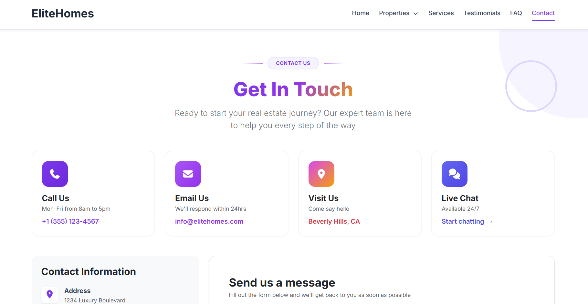

#### Contact Details & Message Form
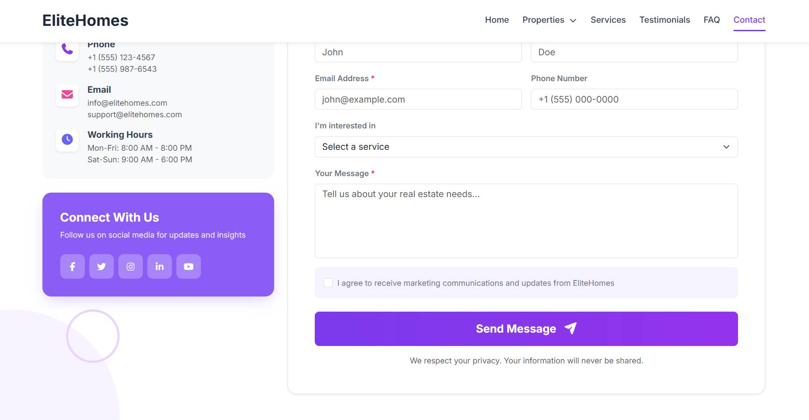

#### Footer Section
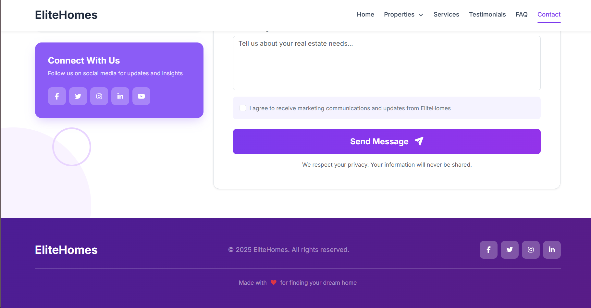

---

### 6. 📱 Responsive Layouts (Tablet & Mobile Views)
#### Tablet View
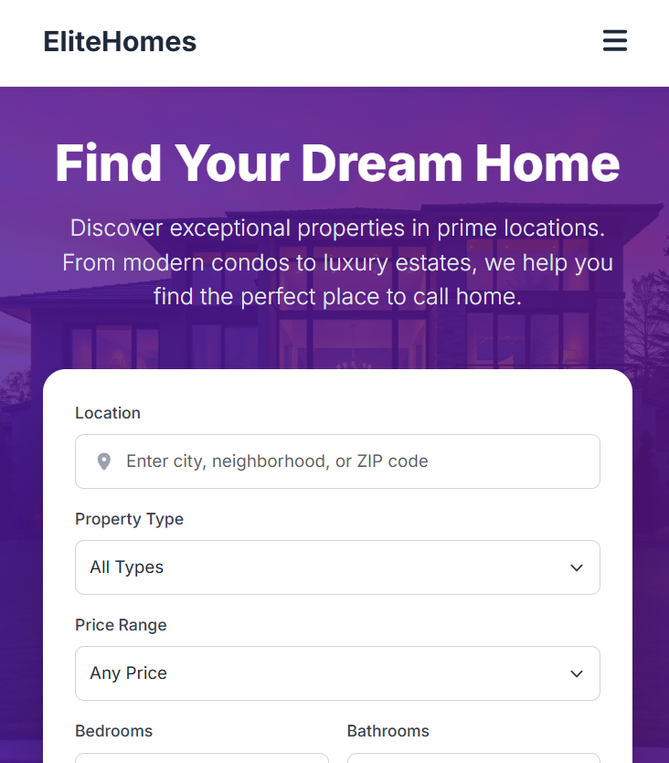

#### Mobile View & Navigation Drawer
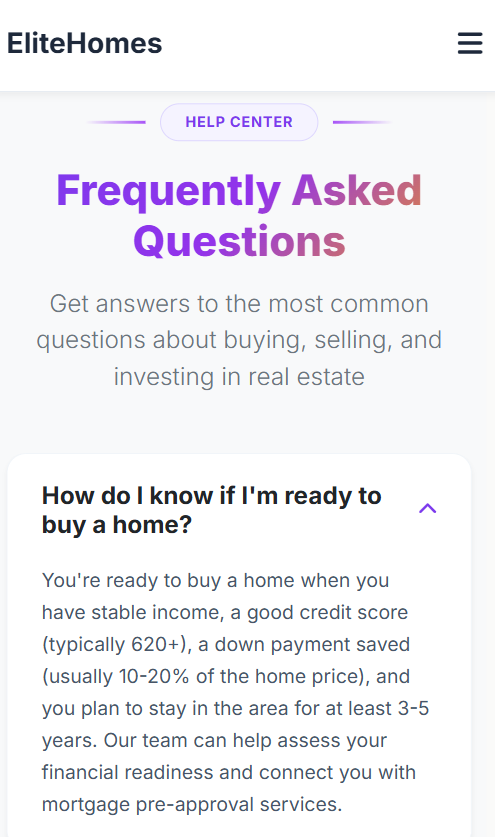

---

## 🌟 Key Features

### 1. 🎯 Header & Navigation
- **Fixed Navbar**: Remains pinned to the top of the viewport with subtle drop shadows.
- **Bootstrap 5 Scrollspy**: Dynamically highlights navigation links (*Home*, *Properties*, *Services*, *Testimonials*, *FAQ*, *Contact*) as the user scrolls into each section.
- **Properties Mega Menu**: Centered dropdown popup displaying featured listings, property categories, popular locations, and buyer resources.
- **Responsive Mobile Navigation**: Clean collapse menu with custom active pill highlight and icon toggling (*Hamburger bars / Close X*).

### 2. 🏰 Hero Section
- **Fixed Gradient Background**: High-resolution hero background image with deep purple overlay.
- **Comprehensive Search Console**: Multi-parameter filter box for location, property type, price range, bedrooms, bathrooms, and square footage.
- **Quick Stats Bar**: Clean stats counter displaying listings count, client satisfaction rate, expert agent count, and years of experience.

### 3. 🏡 Featured Properties Section
- **Premium Collection Badge**: Centered section badge pill with gradient side accent lines.
- **Gradient Headings**: Vibrant multi-color text gradient (*violet to purple to gold*).
- **Interactive Property Cards**: Features property badges (*Featured*, *New Listing*, *Price Drop*), photo counters, heart favorite buttons, pricing details, agent avatars, and hover zoom effects.

### 4. 🛠️ Our Services Section
- **Bootstrap 5 Native Tabs**: Seamless tabbed navigation between 5 core real estate service categories:
  - 🏠 **Buying**: Home search, financial planning, and negotiation support.
  - 💰 **Selling**: Market analysis, professional photography, and buyer screening.
  - 🔑 **Renting**: Prime location rentals, verified properties, and 24/7 maintenance.
  - 📊 **Investing**: Portfolio analysis, ROI projections, and property management.
  - 🏢 **Commercial**: Office spaces, industrial properties, and retail locations.

### 5. 💬 Testimonials Section ("What Our Clients Say")
- **Auto-Playing Carousel**: Built-in Bootstrap 5 Carousel slider auto-playing every 4 seconds.
- **Pagination Indicators**: 4 dot indicators centered below testimonial cards allowing manual slide jumps.
- **Arrow Navigation**: Circular blur arrow controls for previous and next slide transitions.

### 6. ❓ Frequently Asked Questions (FAQ) Section
- **Collapsible Accordions**: Animated `<details>` & `<summary>` items with smooth expand/collapse.
- **Thin Chevron Icons**: Right-aligned chevron icons (`fa-chevron-down`) that rotate 180° upon expansion.

### 7. 📬 Contact Us & Connect Section
- **Contact Cards**: Direct contact cards for phone support, email, office location, and live chat.
- **Overlapping Background Circles**: Distinctive solid light-purple circles and hollow purple-bordered rings.
- **"Connect With Us" Card**: Bright purple social media card featuring 5 social platforms (*Facebook*, *Twitter*, *Instagram*, *LinkedIn*, *YouTube*) with hover transitions and cursor pointer states.
- **Message Form**: Non-resizable text area message input preventing layout distortion.

---

## 🛠️ Technology Stack

- **HTML5**: Semantic markup, `<details>` accordion components, aria attributes.
- **CSS3**: Custom design tokens, HSL colors, gradient typography, transitions, pseudo-elements, and flex/grid layouts.
- **Bootstrap 5.3**: Grid system, Utilities, Tabs, Carousel, Dropdowns, Collapse, and Scrollspy.
- **Font Awesome 6**: Vector icons for interface controls, social media, and property meta details.
- **Google Fonts**: Inter font family (`wght@300;400;500;600;700;800;900`).

---

## 📂 Project Structure

```
Exam 1/
├── index.html                  # Main Landing Page Document
├── README.md                   # Project Documentation
├── favicon.png                 # Site Favicon (Building Icon)
├── CSS/
│   ├── main.css                # Custom Styling & Design System
│   ├── bootstrap.min.css       # Bootstrap 5 Stylesheet
│   └── all.min.css             # Font Awesome Icons Stylesheet
├── JS/
│   ├── bootstrap.bundle.min.js # Bootstrap 5 Bundle JS (Carousel, Tabs, Dropdowns)
│   └── all.min.js              # Font Awesome JS
├── images/                     # Property, Avatar, Location & Service Media Assets
│   ├── hero-bg-img.png
│   ├── featured-properties-img-1.png ... img-3.png
│   ├── service-img-1.webp ... img-5.png
│   ├── avatar-1.jpg ... avatar-5.jpg
│   └── los-angeles.jpeg, miami.jpeg, new-york.jpeg, luxury-villa.jpeg, modern-apartment.jpeg
└── screenshots/                # Section Previews & Responsive Screenshots
    ├── 01-hero-section.png
    ├── 02-properties-mega-menu.png
    ├── 03-featured-properties.png
    ├── 04-our-services-buying-tab.png
    ├── 04b-our-services-selling-tab.png
    ├── 04c-our-services-renting-tab.png
    ├── 04d-our-services-investing-tab.png
    ├── 04e-our-services-commercial-tab.png
    ├── 05-testimonials-carousel.png
    ├── 06-faq-accordion.png
    ├── 07-contact-us-section.png
    ├── 07b-contact-us-section.png
    ├── 08-footer.png
    ├── 09-tablet-screen.png
    └── 10-mobile-screen.png
```

---

## 🚀 How to Run the Project

1. **Clone or Download** the project repository.
2. Open `index.html` directly in any modern web browser (Google Chrome, Mozilla Firefox, Microsoft Edge, Safari).
3. Alternatively, launch with **Live Server** extension in VS Code.

---

## 🎨 Design Highlights

- **Gradient Typography**: Uses `linear-gradient(135deg, #7c3aed 0%, #9333ea 50%, #f59e0b 100%)` with background-clip text masking for section headers.
- **Pixel-Perfect Circles**: Decorative background circles (`.bg-circle-1` through `.bg-circle-4`) creating a subtle architectural aesthetic.
- **Responsive Layout**: Designed for seamless viewing across Desktop (1400px+), Tablet (768px - 1024px), and Mobile (<768px) devices.

---

© 2025 **EliteHomes**. Developed for Frontend Diploma Exam 1.
